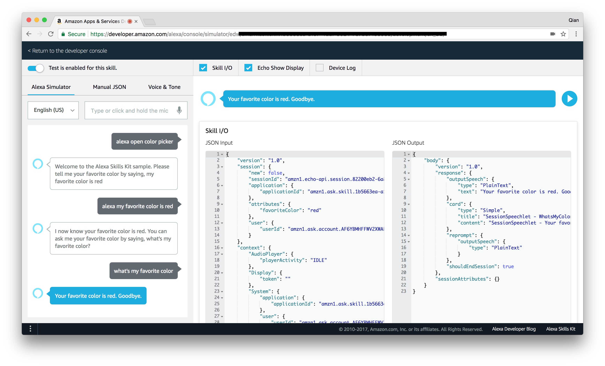

Alexa Voice Service
===================

For this part of the hands-on, we will start by playing with the Amazon Echo to
get a better understanding of Alexa. Then we will continue to build a more comprehensive
prototype for Alexa Voice Service.

# Setup your Echo / Echo Dot

Check [here](https://www.amazon.com/gp/help/customer/display.html?nodeId=201994280)
for detailed instructions. 

You can either use your mobile device or your computer to do the setup. But be
careful, if your iTunes or Google Play country is not among Alexa app's distribution
country list, you won't be able to download the app.

The easiest way is to use their web site: https://alexa.amazon.com

# Exercise 1: Build an Alexa Skill with Lambda (Python)

Start building for Alexa with this quick walkthrough of the skill-building process. 
You’ll end with a simple but complete Alexa skill that can run on Amazon Echo or 
any device with Alexa. This tutorial uses the [Alexa Skills Kit](https://developer.amazon.com/alexa-skills-kit), 
[AWS Lambda](https://aws.amazon.com/lambda/), and Python.

See here: [Alexa Python Tutorial](https://developer.amazon.com/alexa-skills-kit/alexa-skill-quick-start-tutorial)

The screenshots in the tutorial may not be exactly the same as the lastest AWS
console but you should be able to finish it without problem. At the end, you can
go to their new testing simulator and test your Alexa skill:

# Exercise 2: 

# Resource

- [Amazon Alexa Portail](https://developer.amazon.com/alexa)
- [Announcing New Test Simulator (Beta) for Alexa Skills](https://developer.amazon.com/blogs/alexa/post/577069bd-d9f9-439a-b4bf-3b0495e3d24b/announcing-new-test-simulator-beta-for-alexa-skills)