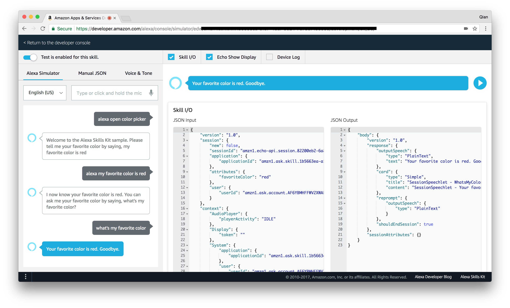

Amazon Alexa
============

For this part of the hands-on, we will start by playing with the Amazon Echo to
get a better understanding of Alexa. Then we will continue to build a more comprehensive
prototype for Alexa Voice Service.

# Setup your Echo / Echo Dot

Check [here](https://www.amazon.com/gp/help/customer/display.html?nodeId=201994280)
for detailed instructions. 

You can either use your mobile device or your computer to do the setup. But be
careful, if your iTunes or Google Play country is not among Alexa app's distribution
country list, you won't be able to download the app.

The easiest way is to use their web site: https://alexa.amazon.com

# Exercise 1: Build an Alexa Skill with Lambda (Python)

Start building for Alexa with this quick walk-through of the skill-building process. 
You’ll end with a simple but complete Alexa skill that can run on Amazon Echo or 
any device with Alexa. This tutorial uses the [Alexa Skills Kit](https://developer.amazon.com/alexa-skills-kit), 
[AWS Lambda](https://aws.amazon.com/lambda/) and Python.

See here to get started: [Alexa Python Tutorial](https://developer.amazon.com/alexa-skills-kit/alexa-skill-quick-start-tutorial)

The screenshots in the tutorial may not be exactly the same as the latest AWS
console but you should be able to finish it without problem. At the end, you can
go to their new testing simulator and test your Alexa skill:

This exercise should take you roughly *10min* to finish. Now let's discover how
to use the **Interaction Model Builder** with another exercise.

# Exercise 2: Alexa Fact Sample (Node.js)

This Alexa sample skill is a template for a basic fact skill. Provided a list of 
interesting facts about a topic, Alexa will select a fact at random and tell it 
to the user when the skill is invoked.

See here to get started: [Alexa Fact sample](https://github.com/alexa/skill-sample-nodejs-fact)

In this tutorial you will be using the Interaction model builder and pay attention
to the intent generated once you copy paste and save the model from template.

# Exercise 3: Random Cat Fact

Now you have a Fact skill up and running, you might notice that it only deals
with either *fact* or *space fact*. Let's try to make it better, start by:

- create your own slot type (e.g. `factType` with a list of possible fact type)
- update your intent to get the fact type dynamically
- update your back-end logic to plug some random cat fact using this awesome
[API](https://catfact.ninja/)

So now whenever someone asks Alexa about cat fact, your skill can give out some
random fun fact :)

# Exercise 4: Alexa Voice Service Sample

If you still have time and you want to see how to access and test the Alexa Voice
Service using a Java client and Nods.js server. [Here](https://github.com/alexa/alexa-avs-sample-app)
is a step-by-step instructions to set up the hands-free prototype on Raspberry Pi, 
or follow the instructions to set up the push-to-talk only prototype on Linux, 
Mac, or Windows.

# Resource

- [Amazon Alexa Portal](https://developer.amazon.com/alexa)
- [Amazon Developer Console](https://developer.amazon.com/edw/home.html#/)
- [AWS Console](https://console.aws.amazon.com/)
