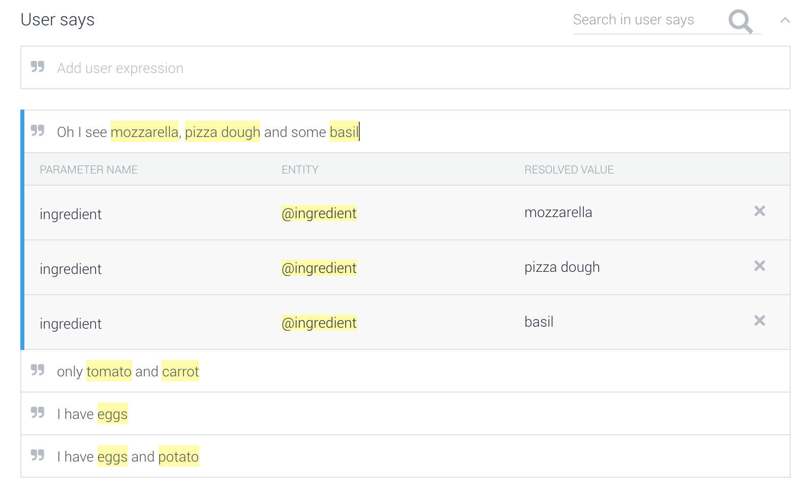

Hands-on: Google Assistant app with Actions on Google
=====================================================

# Objective

The objectif of this hands-on session is to create a conversational application 
for Google Assistant using [Actions on Google](https://developers.google.com/actions/).

Before start, let's clarify some concepts:

- **The Google Assistant**: A conversation between you and Google that helps you get more done in your world.
- **Google Home**: an assistant-enabled smart speaker. Android phones also have the assistant enabled.
- **Actions On Google**: The platform that enables developers to build apps for the Google Assistant. Currently you can use Dialogflow, Actions SDK & Converse.ai to create custom app.

Among different solutions provided by Actions on Google, we are going to use 
[DialogFlow](https://console.dialogflow.com/api-client/) and [Firebase](https://console.firebase.google.com/)
for today's example.

# Application context

A smart recipe assistant that helps you figure out what to cook for dinner. A 
simple conversation example could be:

```
User: OK Google, talk to Recipe Assistant
Google: Okay here is the Recipe Assistant
User: I have eggs and potatos in my fridge, what can I make?
Recipe Assistant: Tortilla! Do you want more information?
User: Good idea! Thank you.
```

# Steps

## 1. Create your application

Create the application in [Actions on Google console](https://console.actions.google.com/). 
This may takes a few seconds depending on your internet connection.


Then choose DialogFlow to add actions. 


You will then be redirected to the [DialogFlow Agent creation](https://console.dialogflow.com/api-client/#/newAgent) 
screen:


Let's stay with DialogFlow V1 API because V2 is still in beta and not very stable.
Agents are best described as NLU (Natural Language Understanding) modules. If you
want to know about the concept, read the document [here](https://dialogflow.com/docs/agents).

Also pay attention to your default language because all the content you are going
to create afterwards are language specific.

## 2. Create your first `Entity`

First let's get an idea of [what does an `Entity` represent in DialogFlow](https://dialogflow.com/docs/entities).

Now that you are ready to create your own entity, go to the `Entities` tab from 
the left side menu. The entity in our recipe assistant example is apparently the ingredient! 
So start by creating this entity and adding some entries that you can think of.

## 3. Create your first `Intent`

An [intent](https://dialogflow.com/docs/intents) represents a mapping between what
a user says and what action should be taken by your software. In the agent that
you just created, there is already a `Default Welcome Intent` and a 
`Default Fallback Intent`. 

Here are the sections to fill up in the Intent creation screen (from top to bottom):

### Contexts

[Contexts](https://dialogflow.com/docs/contexts) are designed for passing on 
information from previous conversations or external sources (e.g., user profile, 
device information, etc). This is a relatively advanced concept. You can discover 
it later when you have several working intents.

### User says

In order to obtain an optimized result, you should at least provide around 10-20 
sentences for the same intent. When you are entering the user expression, you 
will notice that you can annotate words as entities:



You can check [here](https://dialogflow.com/docs/intents#example_annotation) to
understand better how to link a word (or phrase) to an entity.

For our recipe example, user problably would say things like:

- "I have eggs and potatos in my fridge."
- "I want to cook something with eggplant and parmesan."
- "What can I make with cauliflower?"

### Action

Once you finish defining what user says, you have to name your action manually. 
It will be the trigger word for your app to perform a particular action. Parameters 
can be filled in automatically from the `Users says` examples and templates, 
or added manually.

See detailed documentation [here](https://dialogflow.com/docs/actions-and-parameters).

### Response

In this section, you can define your agent’s responses which will be provided 
by your application when the intent is triggered. It can be simple text, or more
sophisticated content with references to parametered values.

You can also add supported [rich messages](https://dialogflow.com/docs/rich-messages),
such as integration with facebook or slack.

#### SSML (Speech Synthesis Markup language)

If you want to embed some audio file and structure your reponse in a more logic
way, you can have a look at [Speech Synthesis Markup Language](https://developers.google.com/actions/reference/ssml).

Here is a simple example:

```xml
<speak>
  Here are <say-as interpret-as="characters">SSML</say-as> samples.
  I can pause <break time="3s"/>.
  I can play a sound
  <audio src="https://www.example.com/MY_MP3_FILE.mp3">didn't get your MP3 audio file</audio>.
  I can speak in cardinals. Your number is <say-as interpret-as="cardinal">10</say-as>.
  Or I can speak in ordinals. You are <say-as interpret-as="ordinal">10</say-as> in line.
  Or I can even speak in digits. The digits for ten are <say-as interpret-as="characters">10</say-as>.
  I can also substitute phrases, like the <sub alias="World Wide Web Consortium">W3C</sub>.
  Finally, I can speak a paragraph with two sentences.
  <p><s>This is sentence one.</s><s>This is sentence two.</s></p>
</speak>
```

- `<speak>`: The root element of the SSML response. 
- `<break>`: An empty element that controls pausing or other prosodic boundaries between words.
- `<say‑as>`: This indicates information about the type of text construct that is 
contained within the element.
- `<audio> `: Supports the insertion of recorded audio files and the insertion 
of other audio formats in conjunction with synthesized speech output.

At the end you can save your Intent and test it with the test console on the
right side of the DialogFlow console or directly with Google Assistant simulator
or device (see the [step 5](https://github.com/xebia-france/hands-on-assistant/tree/master/google-assistant#5-test-your-fulfillment)).

## 4. Fulfill user intentions using webhook

As you reach the end of the `Intent` creation, you will see the section **Fulfillment**.


This is actually the entry point to infinite possibilities, because you are able to
fulfill user's intentions with your own backend logic!

Now check the case `Use Webhook` and start to work on your own fulfillment! In
this Hands-On we are introducing [Firebase Cloud Function](https://firebase.google.com/docs/functions/)
to deploy your backend logic. If you feel more comfortable working with other 
solutions, you can totally go with your own choice.

### 4.1 Set up your Webhook with Firebase functions

We will be using Firebase CLI to achieve most of the tasks, so let's start 
by installing firebase tools:

```
$ npm install -g firebase-tools
```

Then login with your Goolge account which contains your assistant project:

```
$ firebase login
```

Then run following line to initialize a cloud function project:

```
$ firebase init functions
```

If you also want to use other firebase products (e.g. real time database), 
you can try this:

```
$ firebase init
```

Then you can choose from the prompt the ones you need:

```
? Which Firebase CLI features do you want to setup for this folder? Press Space to select features, t
hen Enter to confirm your choices. (Press <space> to select)
❯◯ Database: Deploy Firebase Realtime Database Rules
 ◯ Firestore: Deploy rules and create indexes for Firestore
 ◯ Functions: Configure and deploy Cloud Functions
 ◯ Hosting: Configure and deploy Firebase Hosting sites
 ◯ Storage: Deploy Cloud Storage security rules
```

Once your project is initialized, you can go to `index.js` and uncomment the 
example lines to get your app going:

```
const functions = require('firebase-functions');

exports.helloWorld = functions.https.onRequest((request, response) => {
 response.send("Hello from Firebase!");
});
```

If you need more help on how to get started with cloud function, documentation 
is [here](https://firebase.google.com/docs/functions/get-started).

Now Deploy your functions with following line and retrieve your deploy link
```
$ firebase deploy
```

Go to Fulfillment and update your webhook link.

#### Test with localhost

To accelerate the test, you can serve your function locally:
```
$ firebase serve --only functions
```
and use [ngrok](https://ngrok.com/) to create a secure tunnel to your localhost.
You just have to download the software and launch it with your localhost port:

```
./ngrok http [port]
```

Then you can use the tunnel url as your webhook url.

### 4.2 Implement a fulfillment

Now that your backend is up and running, time to start playing with actions
on Google SDK.

First of all, add the dependency for [actions-on-google SDK](https://www.npmjs.com/package/actions-on-google)
in your `package.json`. Then have a look at the example [`index.js`](example/functions/index.js)
included in the project, which contains a simple example of DialogFlow app with
essential lines to get you started.

Start by:

- name your action on DialogFlow and add it to your app
- implement a simple fulfillment function
- name your parameter on DialogFlow andd add it to your app
- get the argument in your fulfillment function and do something with it

Here is the [API for Actions on Google Node.js SDK](https://developers.google.com/actions/reference/nodejs/AssistantApp).

Now it's time to release your imagination and create some fulfillment on your own.

#### Make your app say or tell

```
app.ask("Hey, what kind of cuisine do you prefere?")

app.tell("You can make a tortilla with potato and eggs!")
```

#### Rich UI

You can try following types of UIs in your fulfillment:

- [Basic card](https://developers.google.com/actions/assistant/responses#basic_card)
- [List Selector](https://developers.google.com/actions/assistant/responses#list_selector)
- or even a [Carousel](https://developers.google.com/actions/assistant/responses#carousel_selector)

#### Mash up with other API

There are quite a lot food API out there. So maybe mashup the user intention
you extracted and come up with some nice suggestion?

## 5. Test your application

In order to test your intent and fulfillment, go to `Integrations` on the left 
menu and click on the Google Assistant. Add the intent you want to test and go on.

You should then be redirected to the simulator screen.

You can either test directly in the simulator by typing text or speaking. Or 
you can test on any of your physical device (Google Home / Android) which is 
connected with your current Google account. For Android device, you have to 
download [Google Assistant](https://play.google.com/store/apps/details?id=com.google.android.apps.googleassistant&hl=en)
from Play Store.

### 5.1 Complete your application's information

You might notice that, in order to activate your application, you have tell 
Google to talk to your `Test App`, if you want your application to have a more 
user-friendly name, you will have to fill up your application information.

You can also update the default welcome intent to have more personalized opening
lines.


## 6. Context

Continue with our recipe example, a user might say, "I have eggplant.", followed
by "what can I cook with it?". By setting a context the app will understand that 
the `it` in second phrase is referring to the `eggplant` from the first request.

By default, contexts expire after either five requests or ten minutes from the 
time they were activated. 

Our recipe assistant is not the perfect example to try out context. You can 
think of something else to play with the context.

## 7. Identity

You must also be interested to know how to build an application with richier 
experience for your users. We will briefly mention 2 ways to achieve that:

### Anonymous User Identity

// TODO

```javascript
const { DialogflowApp } = require('actions-on-google');
const app = new DialogflowApp({ request: req, response: res });
const userId = app.getUser().userId;
```

### Account linking

Account linking helps you build richer experiences for your users by taking 
advantage of the data they already have in their account.

// TODO

# Annexes

- [Actions on Google Node.js reference](https://developers.google.com/actions/reference/nodejs/AssistantApp)


